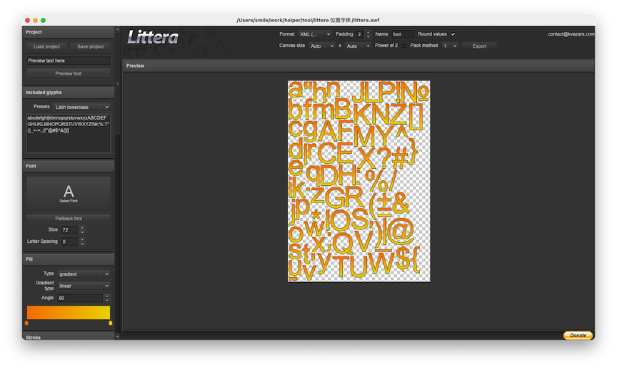

# Littera-bitmap-font-generator

### 2026-03-06 增加App文件

Littera — bitmap font generator 本地版本

```bash
.
├── apps
│   ├── littera.app
│   └── littera.exe
├── Flash Player.app
│   └── Contents
├── Littera — bitmap font generator_files
│   ├── ga.js
│   ├── littera.swf.下载
│   └── swfobject.js
├── Littera — bitmap font generator.html
├── littera.swf
├── README
│   ├── download.gif
│   └── image-20210204125432022.png
└── README.md

7 directories, 9 files
Mac~/jsroads/asroads/Littera-bitmap-font-generator(main↑1|✔) %

```

### 字体编辑器 

Littera 是一款很优秀的位图字体编辑器，可以在线编辑生成位图字体，其网站主要工具就是一个swf 文件

Flash 被浏览器禁用后，如果想继续使用无非是选择可以支持的浏览器或者找一个播放软件，那么官方的这个 独立版本的软件上自然是一个最佳选择。 



Adobe Flash Player 有独立运行版，不依赖浏览器可以单独打开。点击网址 https://www.adobe.com/support/flashplayer/debug_downloads.html ，找到适合自己操作系统的版本下载即可。

[Adobe Flash Player Support Center 点击打开](https://www.adobe.com/support/flashplayer/debug_downloads.html)

> **Adobe Flash Player 32 (Win, Mac & Linux) standalone (aka projectors) players for Flex and Flash developers.**
>
> **Windows**
>
> - [Download the Flash Player projector content debugger](https://fpdownload.macromedia.com/pub/flashplayer/updaters/32/flashplayer_32_sa_debug.exe)
> - [Download the Flash Player projector](https://fpdownload.macromedia.com/pub/flashplayer/updaters/32/flashplayer_32_sa.exe)
>
> **Macintosh**
>
> - [Download the Flash Player projector content debugger](https://fpdownload.macromedia.com/pub/flashplayer/updaters/32/flashplayer_32_sa_debug.dmg)
> - [Download the Flash Player projector](https://fpdownload.macromedia.com/pub/flashplayer/updaters/32/flashplayer_32_sa.dmg)
>
> **Linux**
>
> - [Download the Flash Player Projector (64-bit)](https://fpdownload.macromedia.com/pub/flashplayer/updaters/32/flash_player_sa_linux.x86_64.tar.gz)
> - [Download the Flash Player Projector content debugger (64-bit)](https://fpdownload.macromedia.com/pub/flashplayer/updaters/32/flash_player_sa_linux_debug.x86_64.tar.gz)
>
> #### PlayerGlobal (.swc)
>
> - [Download the playerglobal.swc to target the latest version APIs](https://fpdownload.macromedia.com/get/flashplayer/updaters/32/playerglobal32_0.swc)


#### H5在线替代  

[snowb](https://snowb.org/)

https://github.com/SilenceLeo/snowb-bmf


